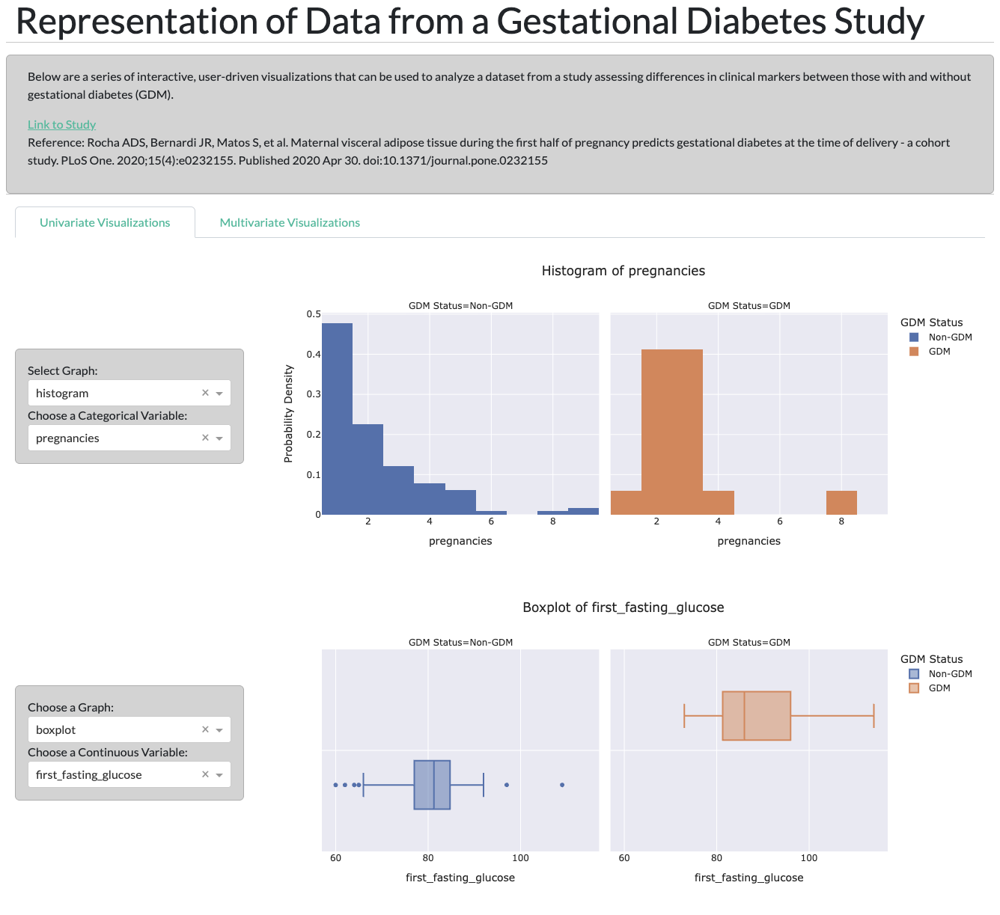
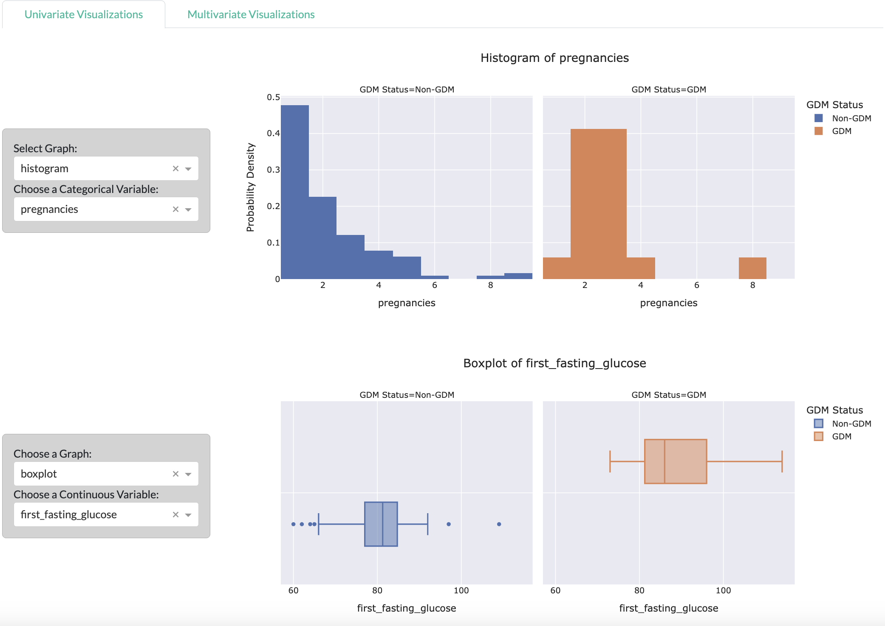
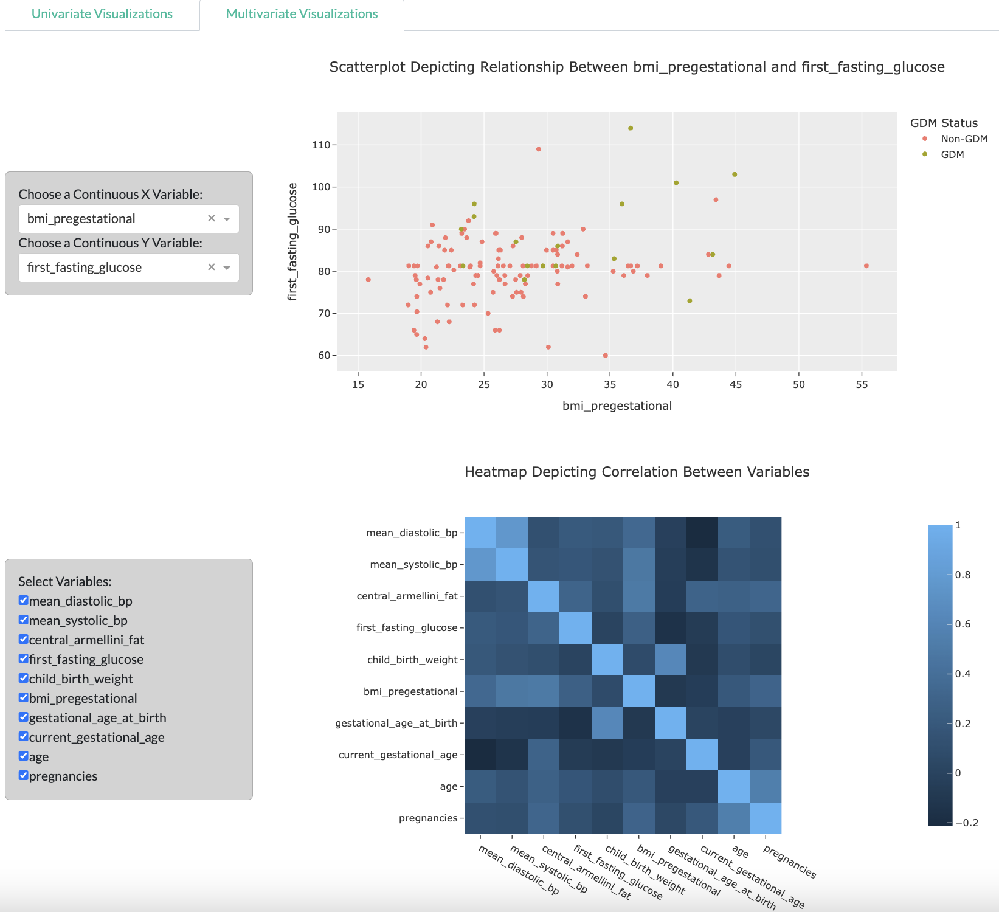

# Clinical Risk Factors for Gestational Diabetes Analysis App
I created an interactive, user-driven app using Plotly Dash where users can analyze the findings from a gestational diabetes study.

The [Dataset](https://physionet.org/content/maternal-visceral-adipose/1.0.0/) used is from a study that measured various clinical factors in pregnant women that are shown to be altered in gestational diabetes.

### Background on the Relationship Between Visceral Adipose Tissue and Gestational Diabetes
Study:
[Maternal visceral adipose tissue during the first half of pregnancy predicts gestational diabetes at the time of delivery – a cohort study](https://www.ncbi.nlm.nih.gov/pmc/articles/PMC7192370/)

Description of study: Visceral adipose tissue has been linked with cardiometabolic dysfunction (e.g insulin resistance, diabetes, heart disease). BMI has been shown to be linked with gestational diabetes but this metric does not differentiate between muscle, fat, and bone mass; nor does it indicate fat distribution around the body. Visceral adipose tissue therefore may be a better indicator of cardiometabolic risk. In this study, visceral adipose tissue was measured in a cohort of 133 women in the first half of pregnancy to assess if it could be used to predict gestational diabetes at the end of pregnancy.

Reference: Rocha ADS, Bernardi JR, Matos S, et al. Maternal visceral adipose tissue during the first half of pregnancy predicts gestational diabetes at the time of delivery - a cohort study. PLoS One. 2020;15(4):e0232155. Published 2020 Apr 30. doi:10.1371/journal.pone.0232155

## Project Features
This application contains two tabs: Univariate Visualizations and Multivariate Visualizations.

### Univariate Visualizations

### Histogram
Gather insights on distribution of categorical variables in those with and without gestational diabetes. Variables included are ethnicity, type of delivery (c-section vs. vaginal), and number of pregnancies.

### Boxplot
Gather insights on the distribution of continuous variables in those with and without gestational diabetes. The following variables can be selected: "mean_diastolic_bp", "mean_systolic_bp", "central_armellini_fat","first_fasting_glucose","bmi_pregestational", "child_birth_weight", "gestational_age_at_birth"current_gestational_age", and "age".

### Multivariate Visualizations

### Scatterplot
Gather insights on the relationship between two continuous variables using a scatter plot in those with and without gestational diabetes. The following variables can be selected: "mean_diastolic_bp", "mean_systolic_bp", "central_armellini_fat","first_fasting_glucose","bmi_pregestational", "child_birth_weight", "gestational_age_at_birth"current_gestational_age", and "age".

### Heatmap
The heatmap can be used to determine correlation between two continuous variables. By default all the variables are checked off (so they are displayed). Feel free to uncheck variables to remove them from the heatmap. Correlation coefficient range from -1 to 1. The closer the value is to 1, the higher the positive correlation. The closer the value is to -1, the higher the negative correlation. The closer the value is to 0, the lower the correlation is between the variables. A value of 0 would mean no correlation between the two variables.

## How to Install and Run the Project
Make sure you are connected to the internet since the dashboard fetches data from the USGS API.
1. Clone the repository.
2. Set up a Python virtual environment.
3. Install the packages listed in requirements.txt.
4. Run the app. The app will start a local server which allows for the dashboard to be viewed.

### License

